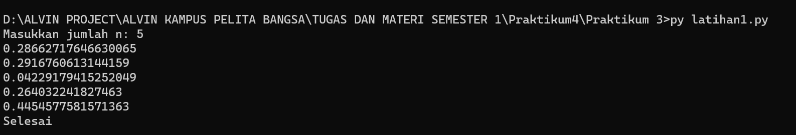
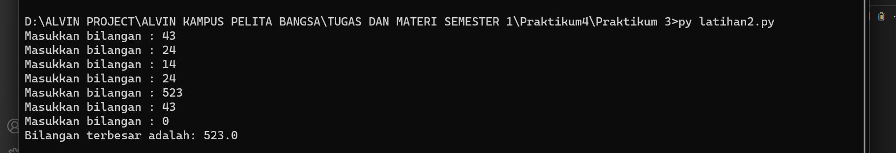
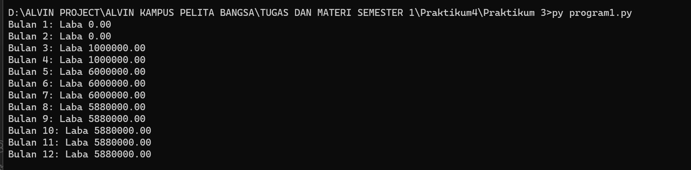

# Tugas Praktikum 3

## Latihan 1

## kode program

``````
import random

n = int(input("Masukkan jumlah n: "))

count = 0

while count < n:
    bilangan = random.random()  # Menghasilkan bilangan acak antara 0 dan 1
    if bilangan < 0.5:
        print(bilangan)
        count += 1

print("Selesai")
``````

## output




## Latihan  2
### kode program

``````
#Inisialisasi variabel untuk menyimpan bilangan terbesar
bilangan_terbesar = None

while True:
    angka = float(input("Masukkan bilangan : "))

    # Periksa apakah pengguna ingin berhenti
    if angka == 0:
        break

    # Periksa apakah angka yang dimasukkan lebih besar dari yang sebelumnya
    if bilangan_terbesar is None or angka > bilangan_terbesar:
        bilangan_terbesar = angka

if bilangan_terbesar is not None:
    print(f"Bilangan terbesar adalah: {bilangan_terbesar}")
else:
    print("Tidak ada bilangan yang dimasukkan.")
``````

### output 



## Program1.py

### Kode program

``````
modal_awal = 100_000_000  # Modal awal sebesar 100 juta
labas = []  # Daftar laba bulanan

#Loop dari bulan 1 hingga bulan 12
for bulan in range(1, 13):
    if bulan <= 2:
        laba = 0  # Bulan pertama dan kedua belum mendapatkan laba
    elif bulan == 3:
        laba = modal_awal * 0.01  # Bulan ketiga mendapatkan laba 1%
    elif bulan == 5:
        laba = modal_awal * 0.06  # Bulan kelima mendapatkan laba 5%
    elif bulan == 8:
        laba = modal_awal * 0.06 * 0.98  # Bulan kedelapan mengalami penurunan 2%
    else:
        laba = labas[bulan - 2]  # Laba bulan sebelumnya

    labas.append(laba)

#Print hasil laba bulanan
for bulan, laba in enumerate(labas, start=1):
    print(f"Bulan {bulan}: Laba {laba:.2f}")
``````

## maka outputnya 



