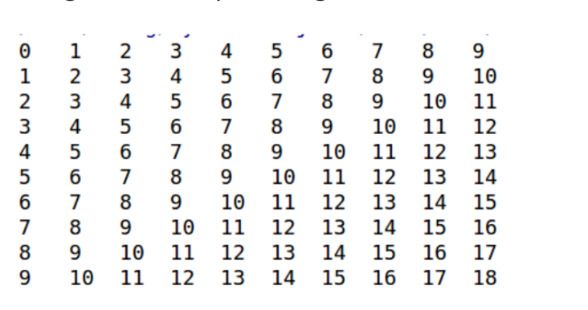

# Praktikum 7

## Latihan 1

* Buat program sederhada dengan input 2 buah bilangan, kemudian
tentukan bilangan terbesar dari kedua bilangan tersebut
menggunakan statement if.

``````
bilangan1 = float(input("Masukan bilangan pertama : "))
bilangan2 = float(input("Masukan bilangan kedua : "))


if bilangan1 > bilangan2:
   bilangan_terbesar = bilangan1
else:
   bilangan_terbesar = bilangan2

   print("Bilangan terbesar adalah :", bilangan_terbesar )
``````

 ### Maka outputnya
 


## Latihan 2

* Buat program untuk mengurutkan data berdasarkan input sejumlah
data (minimal 3 variable input atau lebih), kemudian tampilkan
hasilnya secara berurutan mulai dari data terkecil.

``````
# Meminta pengguna memasukkan 3 bilangan
bilangan1 = float(input("Masukkan bilangan ke-1: "))
bilangan2 = float(input("Masukkan bilangan ke-2: "))
bilangan3 = float(input("Masukkan bilangan ke-3: "))


if bilangan1 <= bilangan2 <= bilangan3:
    urutan_bilangan = (bilangan1, bilangan2, bilangan3)
elif bilangan1 <= bilangan3 <= bilangan2:
    urutan_bilangan = (bilangan1, bilangan3, bilangan2)
elif bilangan2 <= bilangan1 <= bilangan3:
    urutan_bilangan = (bilangan2, bilangan1, bilangan3)
elif bilangan2 <= bilangan3 <= bilangan1:
    urutan_bilangan = (bilangan2, bilangan3, bilangan1)
elif bilangan3 <= bilangan1 <= bilangan2:
    urutan_bilangan = (bilangan3, bilangan1, bilangan2)
else:
    urutan_bilangan = (bilangan3, bilangan2, bilangan1)


print("Urutan bilangan:", urutan_bilangan)
``````

### Maka outputnya


# Lab 3: Perulangan

## Latihan 1

* Buat program dengan perulangan bertingkat (nested) for yang
menghasilkan output sebagai berikut:



## kode programnya
``````
baris = 10
kolom = baris

for bar in range(baris):
    for col in range(kolom):
        tab = bar+col
        print("{0:>5}".format(tab), end='')
    print()
``````

## maka outputnya


## Latihan 2

* Tampilkan n bilangan acak yang lebih kecil dari 0.5.
* nilai n diisi pada saat runtime
* anda bisa menggunakan kombinasi while dan for untuk
menyelesaikannya

## kode programnya

``````
import random

n = int(input("Masukkan jumlah n: "))

count = 0

while count < n:
    bilangan = random.random()  # Menghasilkan bilangan acak antara 0 dan 1
    if bilangan < 0.5:
        print(bilangan)
        count += 1

``````

## maka outputnya


